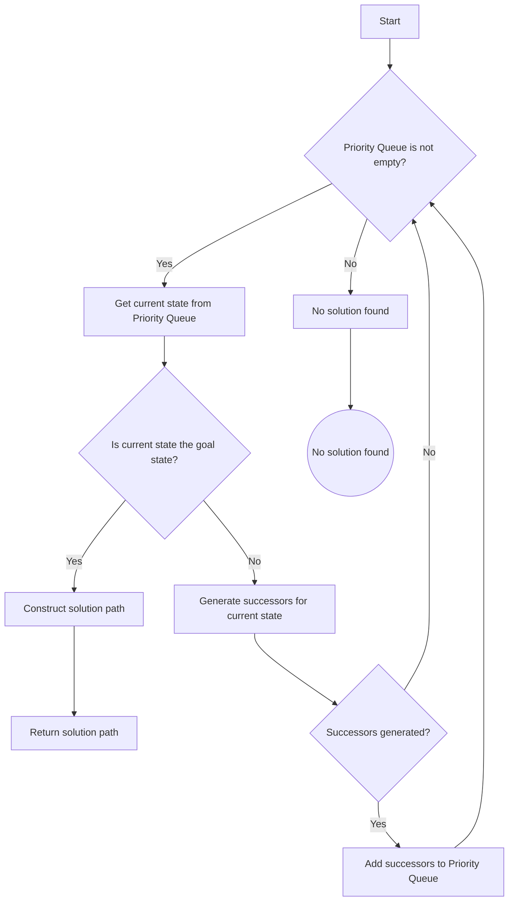

# 8-Puzzle Problem

> The 8-puzzle is a sliding puzzle consisting of eight tiles, numbered 1 through 8, placed in a 3x3 grid with one empty space. The goal is to rearrange the tiles from a given initial configuration to a goal configuration by sliding tiles into the empty space.


## PuzzleState Class

The `PuzzleState` class represents a state of the puzzle, including the puzzle configuration, the heuristic value, and a reference to the parent state. 

```python
class PuzzleState:
    def __init__(self, puzzle, heuristic, parent=None):
        self.puzzle = puzzle
        self.heuristic = heuristic
        self.parent = parent

    def __lt__(self, other):
        return self.heuristic < other.heuristic
```


### PriorityQueue Class

The PriorityQueue class is a simple implementation of a priority queue using a list. It supports operations like putting an item into the queue, getting the item with the highest priority, and checking if the queue is empty.

```python
class PriorityQueue:
    def __init__(self):
        self.queue = []

    def put(self, item):
        self.queue.append(item)
        self.queue.sort()

    def get(self):
        return self.queue.pop(0)

    def empty(self):
        return len(self.queue) == 0
```

### Best-First Search Algorithm

The BestFirstSearch function performs the best-first search algorithm to find the optimal solution. It starts from the initial state and explores the state space by prioritizing states with lower heuristic values.

```python
def BestFirstSearch(initial_state):
    pq = PriorityQueue()
    pq.put(initial_state)

    while not pq.empty():
        current_state = pq.get()

        if IsGoalState(current_state.puzzle):
            return Solution(current_state)

        successors = generate_successors(current_state)
        for successor in successors:
            pq.put(successor)

    return "No solution found"
```



### Heuristic Function

The heuristic function calculates the number of misplaced tiles in the puzzle configuration compared to the goal state. It is used to estimate the distance from the current state to the goal state.

```python
def heuristic(state):
    count_misplaced_tiles = 0
    goal_state = [[1, 2, 3], [4, 5, 6], [7, 8, 0]]
    for i in range(3):
        for j in range(3):
            if state[i][j] != goal_state[i][j]:
                count_misplaced_tiles += 1
    return count_misplaced_tiles
```

### Other Helper Functions

- generate_successors: Generates successor states by moving the empty tile in all possible directions.
- FindEmptyPosition: Finds the position of the empty tile in the puzzle configuration.
- IsGoalState: Checks if the current puzzle configuration is the goal state.
- Solution: Constructs the solution path by tracing back from the goal state to the initial state.

```python
def generate_successors(state):
    successors = []
    EmptyPosition = FindEmptyPosition(state.puzzle)

    for move in [(0, -1), (0, 1), (-1, 0), (1, 0)]:
        TempX = EmptyPosition[0] + move[0]
        TempY = EmptyPosition[1] + move[1]
        if 0 <= TempX < 3 and 0 <= TempY < 3:
            Temp = [row[:] for row in state.puzzle]
            Temp[EmptyPosition[0]][EmptyPosition[1]] = Temp[TempX][TempY]
            Temp[TempX][TempY] = 0
            successors.append(PuzzleState(Temp, heuristic(Temp), parent=state))

    return successors

def FindEmptyPosition(puzzle):
    for i in range(3):
        for j in range(3):
            if puzzle[i][j] == 0:
                return (i, j)

def IsGoalState(puzzle):
    goal_state = [[1, 2, 3], [4, 5, 6], [7, 8, 0]]
    return puzzle == goal_state

def Solution(goal_state):
    path = []
    current_state = goal_state
    while current_state.parent:
        path.insert(0, current_state.puzzle)
        current_state = current_state.parent
    path.insert(0, current_state.puzzle)
    return path
```


## Test

```python
initial_state = PuzzleState([[1, 2, 3], [4, 5, 6], [0, 7, 8]], heuristic([[1, 2, 3], [4, 5, 6], [0, 7, 8]]))

solution = BestFirstSearch(initial_state)

for soln in solution:
    for sol in soln:
        print(sol)
    print()
```


---
## Here is the entire code for you to try

```python
class PuzzleState:
    def __init__(self, puzzle, heuristic, parent=None):
        self.puzzle = puzzle
        self.heuristic = heuristic
        self.parent = parent

    def __lt__(self, other):
        return self.heuristic < other.heuristic

class PriorityQueue:
    def __init__(self):
        self.queue = []

    def put(self, item):
        self.queue.append(item)
        self.queue.sort()

    def get(self):
        return self.queue.pop(0)

    def empty(self):
        return len(self.queue) == 0

def BestFirstSearch(initial_state):
    pq = PriorityQueue()
    pq.put(initial_state)

    while not pq.empty():
        current_state = pq.get()

        if IsGoalState(current_state.puzzle):
            return Solution(current_state)

        successors = generate_successors(current_state)
        for successor in successors:
            pq.put(successor)

    return "No solution found"

def heuristic(state):
    count_misplaced_tiles = 0
    goal_state = [[1, 2, 3], [4, 5, 6], [7, 8, 0]]
    for i in range(3):
        for j in range(3):
            if state[i][j] != goal_state[i][j]:
                count_misplaced_tiles += 1
    return count_misplaced_tiles

def generate_successors(state):
    successors = []
    EmptyPosition = FindEmptyPosition(state.puzzle)

    for move in [(0, -1), (0, 1), (-1, 0), (1, 0)]:
        TempX = EmptyPosition[0] + move[0]
        TempY = EmptyPosition[1] + move[1]
        
        if 0 <= TempX < 3 and 0 <= TempY < 3:
            Temp = [row[:] for row in state.puzzle]
            Temp[EmptyPosition[0]][EmptyPosition[1]] = Temp[TempX][TempY]
            Temp[TempX][TempY] = 0
            successors.append(PuzzleState(Temp, heuristic(Temp), parent=state))

    return successors

def FindEmptyPosition(puzzle):
    for i in range(3):
        for j in range(3):
            if puzzle[i][j] == 0:
                return (i, j)

def IsGoalState(puzzle):
    goal_state = [[1, 2, 3], [4, 5, 6], [7, 8, 0]]
    return puzzle == goal_state

def Solution(goal_state):
    path = []
    current_state = goal_state
    while current_state.parent:
        path.insert(0, current_state.puzzle)
        current_state = current_state.parent
    path.insert(0, current_state.puzzle)
    return path

initial_state = PuzzleState([[1, 2, 3], [4, 5, 6], [0, 7, 8]], heuristic([[1, 2, 3], [4, 5, 6], [0, 7, 8]]))
solution = BestFirstSearch(initial_state)

for soln in solution:
    for sol in soln:
        print(sol)
    print()
```

Output:

```
[1, 2, 3]
[4, 5, 6]
[0, 7, 8]

[1, 2, 3]
[4, 5, 6]
[7, 0, 8]

[1, 2, 3]
[4, 5, 6]
[7, 8, 0]
```