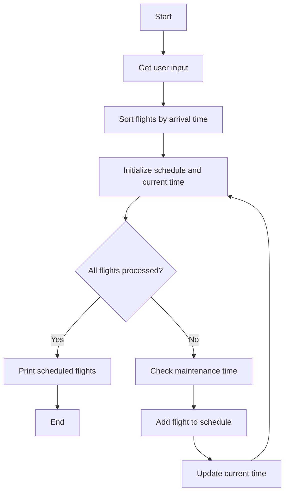

In aviation, efficient scheduling of flights is paramount to ensure smooth operations and passenger satisfaction. This is a Python implementation of an airline scheduling algorithm.

```python
class Flight:
    def __init__(self, flight, departure, arrival, maintenance=0):
        self.flight = flight
        self.departure = departure
        self.arrival = arrival
        self.maintenance = maintenance

def convert_to_minutes(time_str):
    hours, minutes = map(int, time_str.split())
    return hours * 60 + minutes

def convert_to_time(minutes):
    hours = minutes // 60
    minutes = minutes % 60
    return f"{hours:02d} {minutes:02d}"

def airline_schedule(flights):
    flights.sort(key=lambda x: x.arrival)
    schedule = []
    current_time = 0
    for flight in flights:
        if flight.departure >= current_time + flight.maintenance:
            schedule.append(flight)
            current_time = flight.arrival
    return schedule

def get_user_input():
    flights = []
    while True:
        flight = input("Enter Flight Number (or enter \"done\" to finish): ")
        if flight.lower() == "done":
            break
        departure_str = input("Enter Departure time in 24 hour format: ")
        departure = convert_to_minutes(departure_str)
        arrival_str = input("Enter Arrival time in 24 hour format: ")
        arrival = convert_to_minutes(arrival_str)
        maintenance = int(input("Enter Maintenance time in minutes: "))
        flights.append(Flight(flight, departure, arrival, maintenance))
    return flights

if __name__ == "__main__":
    flights = get_user_input()
    scheduled_flights = airline_schedule(flights)
    print("\nScheduled Flights:")
    for flight in scheduled_flights:
        print(f"Flight {flight.flight}: Departure {convert_to_time(flight.departure)}, Arrival {convert_to_time(flight.arrival)}")
```


