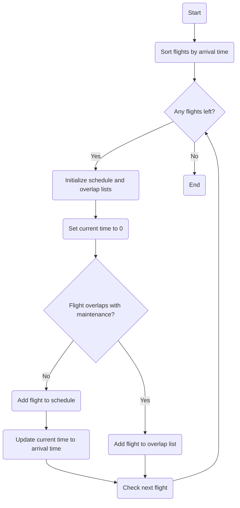

#  Flight Scheduling with Greedy Algorithms

This code performs the following steps:

- Define a Flight class to hold flight details.
- Get flight time in minutes.
- Sorts the flights based on arrival times and schedules them if they don't overlap considering maintenance time.
- Prompts the user to enter flight details.
- Schedules the flights and prints the scheduled flight and overlaped flights details.


### Flight Class
```python
class Flight:
    def __init__(self, flightNumber, departure, arrival, maintenance):
        self.flightNumber = flightNumber
        self.departure = departure
        self.arrival = arrival
        self.maintenance = maintenance
```

### Utility tools
We will use this to convert the time into minutes
```python
def ConvertToMinutes(time):
    hours, minutes = map(int, time.split(':'))
    return hours * 60 + minutes
```

## Flight scheduling algorithm
```python
def ScheduleFlights(flights):
    flights.sort(key=lambda x: x.arrival)
    schedule = []
    overlap = []
    current_time = 0
    for flight in flights:
        departure = ConvertToMinutes(flight.departure)
        arrival = ConvertToMinutes(flight.arrival)
        maintenance = flight.maintenance
        if departure >= current_time + flight.maintenance:
            schedule.append(flight)
            current_time = arrival
        else:
            overlap.append(flight)
    return schedule, overlap
```

### How it works



## Function to get the flight details from the user

We can use this function or we can enter the details manually
```python
def get_flights_from_user():
    flights = []
    while True:
        flightNumber = input("Enter flight name (or 'done' to finish): ")

        if flightNumber.lower() == 'done':
            break
        
        departure_str = input("Enter departure time (HH:MM): ")
        departure = ConvertToMinutes(departure_str)
        arrival_str = input("Enter arrival time (HH:MM): ")
        arrival = ConvertToMinutes(arrival_str)
        maintenance = int(input("Enter maintenance time in minutes: "))
        flights.append(Flight(flightNumber, departure, arrival, maintenance))

    return flights
```

here is a sample flight data for our use:

```python
flights = [
    Flight("flight1", "08:00", "10:30", 30),
    Flight("flight2", "11:00", "13:30", 45),
    Flight("flight3", "14:00", "16:30", 20),
    Flight("flight4", "17:00", "19:30", 35),
    Flight("flight5", "20:00", "22:30", 25)
]
```


```python
# flights = get_flights_from_user() //if you want to take inputs from the user
scheduledFlights, overlapedFlights = ScheduleFlights(flights)

columns=['Flight Number', 'Departure Time', 'Arrival Time', 'Maintenance Time']

flights_df = pd.DataFrame([(flight.flightNumber, flight.departure, flight.arrival, flight.maintenance) for flight in scheduledFlights], columns=columns)

overlapedflights_df = pd.DataFrame([(flight.flightNumber, flight.departure, flight.arrival, flight.maintenance) for flight in overlapedFlights], columns=columns)

print("\nScheduled Flights:")
print(flights_df)

print("\nDelayed Flights due to overlap:")
print(overlapedflights_df)
```


---
## Here is the entire code for you to try

```python
import pandas as pd

class Flight:
    def __init__(self, flightNumber, departure, arrival, maintenance):
        self.flightNumber = flightNumber
        self.departure = departure
        self.arrival = arrival
        self.maintenance = maintenance


def ConvertToMinutes(time):
    hours, minutes = map(int, time.split(':'))
    return hours * 60 + minutes


def ScheduleFlights(flights):
    flights.sort(key=lambda x: x.arrival)
    schedule = []
    overlap = []
    current_time = 0
    for flight in flights:
        departure = ConvertToMinutes(flight.departure)
        arrival = ConvertToMinutes(flight.arrival)
        maintenance = flight.maintenance
        if departure >= current_time + flight.maintenance:
            schedule.append(flight)
            current_time = arrival
        else:
            overlap.append(flight)
    return schedule, overlap

flights = [
    Flight("flight1", "08:00", "10:30", 30),
    Flight("flight2", "11:00", "13:30", 45),
    Flight("flight3", "14:00", "16:30", 20),
    Flight("flight4", "17:00", "19:30", 35),
    Flight("flight5", "20:00", "22:30", 25)
]

scheduledFlights, overlapedFlights = ScheduleFlights(flights)

columns=['Flight Number', 'Departure Time', 'Arrival Time', 'Maintenance Time']

flights_df = pd.DataFrame([(flight.flightNumber, flight.departure, flight.arrival, flight.maintenance) for flight in scheduledFlights],columns=columns)

overlapedflights_df = pd.DataFrame([(flight.flightNumber, flight.departure, flight.arrival, flight.maintenance) for flight in overlapedFlights],columns=columns)


print("\nScheduled Flights:")
print(flights_df)

print("\nDelayed Flights due to overlap:")
print(overlapedflights_df)
```

Output:

Scheduled flights:

| Flight Number | Departure Time | Arrival Time | Maintenance Time |
|---------------|----------------|--------------|------------------|
| flight1       | 08:00          | 10:30        | 30               |
| flight3       | 14:00          | 16:30        | 20               |
| flight5       | 20:00          | 22:30        | 25               |

Delayed Flights due to overlap

| Flight Number | Departure Time | Arrival Time | Maintenance Time |
|---------------|----------------|--------------|------------------|
| flight2       | 11:00          | 13:30        | 45               |
| flight4       | 17:00          | 19:30        | 35               |
