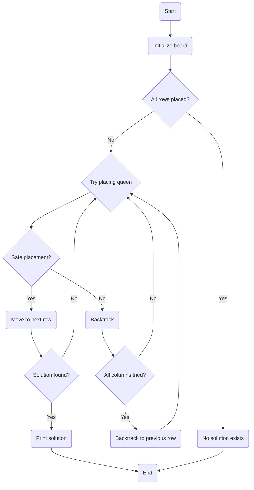

# N-Queens Problem

> Our goal is to develop a solution to place N chess queens on an N×N chessboard so that no two queens threaten each other.


## Algorithm



---
## Here is the entire code for you to try

```python
def IsSafe(board, row, col):
    for i in range(row):
        if board[i] == col or board[i] - i == col - row or board[i] + i == col + row:
            return False
    return True

def Solution(board, row):
    if row == len(board):
        return True
    for col in range(len(board)):
        if IsSafe(board, row, col):
            board[row] = col
            if Solution(board, row + 1):
                return True
            board[row] = -1
    return False

def NQueens(n):
    board = [-1] * n
    if Solution(board, 0):
        for i in range(len(board)):
            for j in range(len(board)):
                if board[i] == j:
                    print("Q", end=" ")
                else:
                    print(".", end=" ")
            print()
    else:
        print("No solution exists")

NQueens(9)
```

Output

```
Q . . . . . . . 
. . . . Q . . . 
. . . . . . . Q 
. . . . . Q . . 
. . Q . . . . . 
. . . . . . Q . 
. Q . . . . . . 
. . . Q . . . . 
```