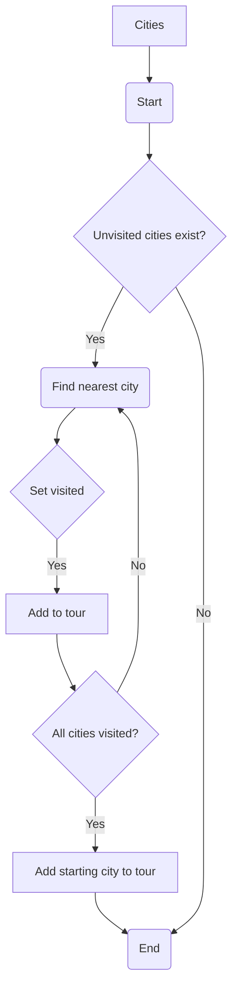

# Travelling Salesman Problem in python

> Given a list of cities and the distances between them, the objective is to find the optimal tour that visits each city exactly once and returns to the starting city, minimizing the total distance traveled.

## Algorithm



---
## Here is the entire code for you to try

```python
import math
import pandas as pd

def TSP(cities):
    currentCity = cities[0]
    tour = [currentCity]
    SetVisited(currentCity)
    totalDistance = 0
    while Check(cities):
        nearest_city, distance = FindNearestCity(currentCity, cities)
        tour.append(nearest_city)
        SetVisited(nearest_city)
        currentCity = nearest_city
        totalDistance = totalDistance + distance
    
    tour.append(tour[0]) 
    return tour, totalDistance

def Check(cities):
    return any(city['visited'] == False for city in cities)

def FindNearestCity(currentCity, cities):
    nearest_distance = float('inf')
    nearest_city = None
    for city in cities:
        if not city['visited']:
            distance = GetDistance(currentCity, city)
            if distance < nearest_distance:
                nearest_distance = distance
                nearest_city = city
    return nearest_city, distance

def SetVisited(city):
    city['visited'] = True

def GetDistance(city1, city2):
    return math.sqrt((city2['x'] - city1['x']) ** 2 + (city2['y'] - city1['y']) ** 2)

cities = [
    {'name': 'Pune', 'x': 0, 'y': 0, 'visited': False},
    {'name': 'Wakad', 'x': 1, 'y': 1, 'visited': False},
    {'name': 'Moshi', 'x': 2, 'y': 2, 'visited': False},
    {'name': 'Hadapsar', 'x': 1, 'y': 3, 'visited': False},
    {'name': 'PCMC', 'x': 0, 'y': 2, 'visited': False}
]

tour, totalDistance = TSP(cities)

df = pd.DataFrame(cities)

print(df)

print("\nTour:")
for i, city in enumerate(tour):
        print(f"Step {i+1}: Visit {city['name']}")

print(f'\nTotal trip cost: {totalDistance}')

```

output:

```
name      x  y  visited
Pune      0  0     True
Wakad     1  1     True
Moshi     2  2     True
Hadapsar  1  3     True
PCMC      0  2     True

Tour:
Step 1: Visit Pune
Step 2: Visit Wakad
Step 3: Visit Moshi
Step 4: Visit Hadapsar
Step 5: Visit PCMC
Step 6: Visit Pune

Total trip cost: 6.82842712474619
```