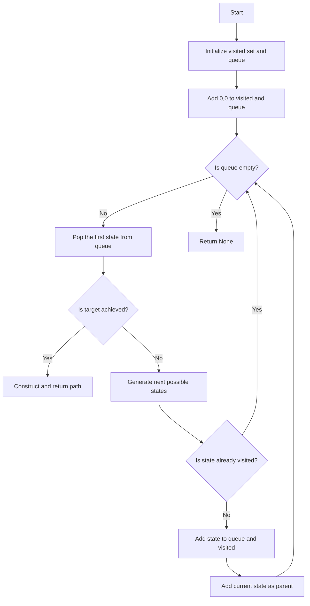
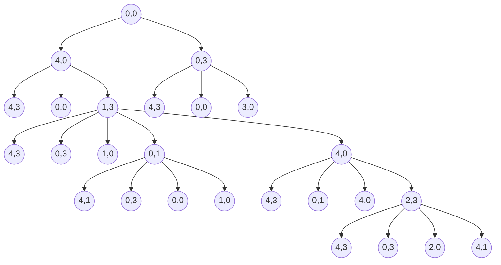

# Problem statement

> You are given with 2 Jugs, 4 liter and a 3 liter one. Neither of the jugs has any Measuring marks on it. There is a pump that can be used to fill the jugs with water. How can we get exactly 2 Gallons of water in 4 liter Jug?

```python
def WaterJugProblem(jug1Capacity, jug2Capacity, target):
    visited = set()
    queue = [(0, 0)]
    visited.add((0, 0))
    parent = {}

    while queue:
        jug1, jug2 = queue.pop(0)

        if jug1 == target or jug2 == target:
            path = []
            while (jug1, jug2) in parent:
                path.append((jug1, jug2))
                jug1, jug2 = parent[(jug1, jug2)]
            path.append((jug1, jug2))
            return list(reversed(path))

        next_states = [
            (jug1Capacity, jug2), (jug1, jug2Capacity), (0, jug2), (jug1, 0),
            (jug1 + min(jug2, jug1Capacity - jug1), jug2 - min(jug2, jug1Capacity - jug1)),
            (jug1 - min(jug1, jug2Capacity - jug2), jug2 + min(jug1, jug2Capacity - jug2))
        ]

        for state in next_states:
            if state not in visited:
                queue.append(state)
                visited.add(state)
                parent[state] = (jug1, jug2)

    return None
```

## Flow Chart



### Tests
```python
print(WaterJugProblem(4, 4, 2))
```
None
```python
print(WaterJugProblem(4, 3, 2))
```
[(0, 0), (0, 3), (3, 0), (3, 3), (4, 2)]
```python
print(WaterJugProblem(3, 4, 2))
```
[(0, 0), (3, 0), (0, 3), (3, 3), (2, 4)]


## Tree for water jug problem

