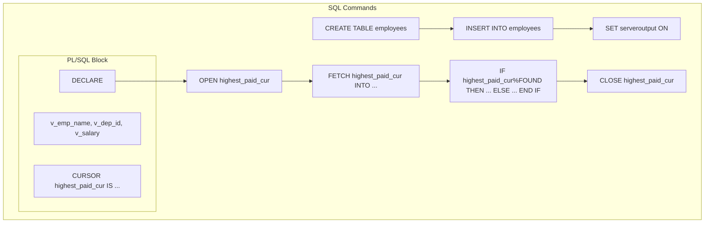

```sql
-- Create the table Employees with the required fields
CREATE TABLE employees (
    first_name VARCHAR(20),
    last_name VARCHAR(20),
    department_id INT,
    salary INT
);

-- Insert sample data into the Employees table
INSERT INTO employees VALUES ('Ram', 'Sharma', 101, 5000);

-- Enable output to display results
SET serveroutput ON;

-- Start PL/SQL block
DECLARE
    -- Declare variables to store employee information
    v_emp_name employees.last_name%TYPE;
    v_dep_id employees.department_id%TYPE;
    v_salary employees.salary%TYPE;
    
    -- Declare a cursor to fetch the highest-paid employees
    CURSOR highest_paid_cur IS
        SELECT last_name, department_id, salary
        FROM employees
        WHERE salary = (SELECT MAX(salary) FROM employees);
BEGIN
    -- Open cursor and fetch employee records
    OPEN highest_paid_cur;
    FETCH highest_paid_cur INTO v_emp_name, v_dep_id, v_salary;

    -- Check if any record is fetched
    IF highest_paid_cur%FOUND THEN
        -- Display employee information
        DBMS_OUTPUT.PUT_LINE('Name: ' || v_emp_name);
        DBMS_OUTPUT.PUT_LINE('Department ID: ' || v_dep_id);
        DBMS_OUTPUT.PUT_LINE('Salary: ' || v_salary);
    ELSE
        -- If no record found, display a message
        DBMS_OUTPUT.PUT_LINE('No employee found.');
    END IF;

    -- Close cursor
    CLOSE highest_paid_cur;
END;
/
```

