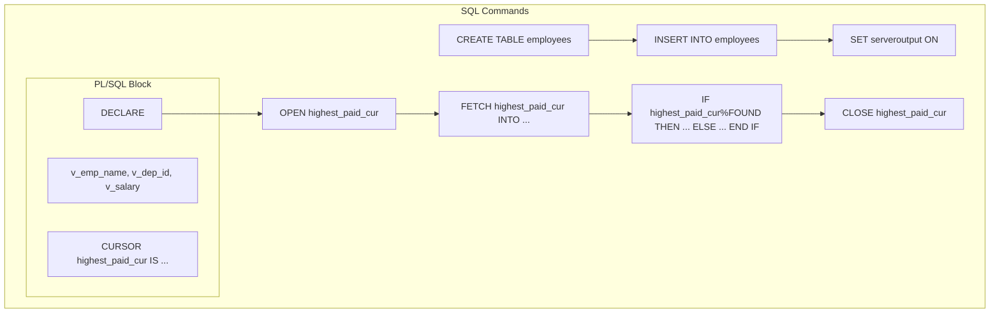

Create `departments` table

```sql
CREATE TABLE departments (
    dept_id INT PRIMARY KEY,
    dept_name VARCHAR(50)
);
```

Create `employees` table

```sql
CREATE TABLE employees (
    emp_id INT PRIMARY KEY,
    emp_name VARCHAR(100),
    dept_id INT,
    salary INT,
    CONSTRAINT fk_dept_id FOREIGN KEY (dept_id) REFERENCES departments(dept_id)
);
```

```sql
INSERT INTO departments 
VALUES 
    (1, 'HR'),
    (2, 'Finance'),
    (3, 'Marketing');
```

```sql
INSERT INTO employees 
VALUES 
    (1, 'Aditya Godse', 1, 50000),
    (2, 'Sakshi Mane', 1, 55000),
    (3, 'Jaydeep Tayshete', 2, 60000),
    (4, 'Brad Pitt', 2, 62000),
    (5, 'Anne Hathaway', 3, 58000),
    (6, 'Tim Cook', 3, 59000),
    (7, 'Sam Altman', 3, 79000);
```

```sql
SET serveroutput ON;
```

### PL/SQL block to display the name, dept_id, and salary of the highest-paid employees by using a cursor

```sql
DECLARE
    v_emp_name employees.emp_name%TYPE;
    v_dept_id employees.dept_id%TYPE;
    v_salary employees.salary%TYPE;
    
    CURSOR c_high_salary IS
        SELECT emp_name, dept_id, salary
        FROM employees
        WHERE (dept_id, salary) IN (
            SELECT dept_id, MAX(salary)
            FROM employees
            GROUP BY dept_id
        );
BEGIN
    OPEN c_high_salary;
    LOOP
        FETCH c_high_salary INTO v_emp_name, v_dept_id, v_salary;
        EXIT WHEN c_high_salary%NOTFOUND;
        DBMS_OUTPUT.PUT_LINE('Name: ' || v_emp_name || ', Department ID: ' || v_dept_id || ', Salary: ' || v_salary);
    END LOOP;
    CLOSE c_high_salary;
END;
/
```

This PL/SQL block will display the name, department ID, and salary of the highest-paid employees in each department.

